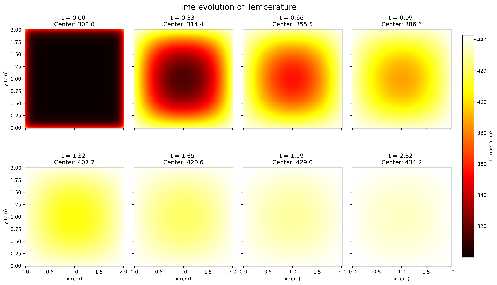
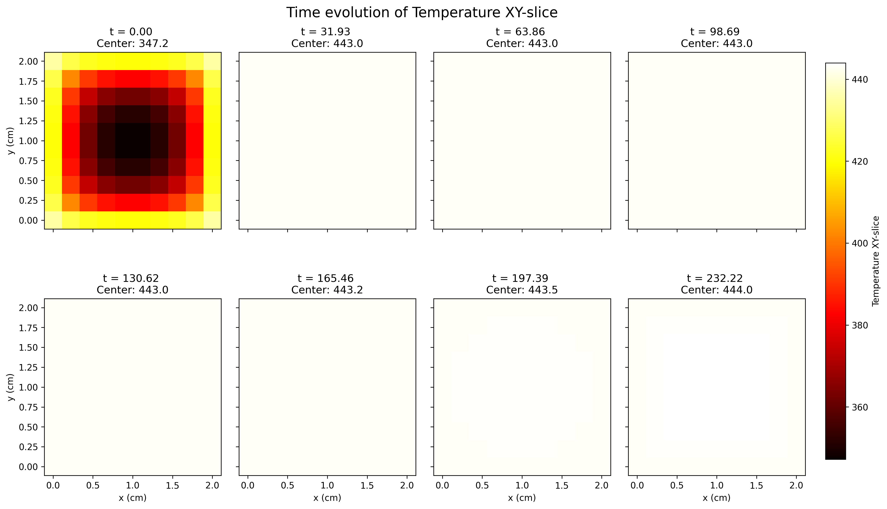

# README

## Curing Process Simulation (2D & 3D)

This repository contains a numerical framework for simulating the heat equation coupled with chemical reaction kinetics (curing). The project uses Finite Difference Methods (FDM) with an implicit Backward Euler scheme to investigate temperature distribution and degree of cure ($\alpha$) in composite materials.

Group project for TMA4212 (Numerical Solution of Differential Equations) at NTNU, spring 2026, with Hallvard Flatberg, Selma Blom, and Line Bekkely. Shared here as a mirror of the original private repository, with course-specific material removed.

| 2D temperature evolution during curing | 3D mold, XY mid-plane slice |
|---|---|
|  |  |

#### Project Structure

**main.py**: The central execution script. It is organized into 8 functional modules (commented blocks) that perform everything from matrix verification to 3D analysis.

**solver.py**: Contains the core numerical engines, including 2D/3D matrix assembly and the implicit solvers.

**config.py**: Centralized configuration of physical constants ($E_a$, $k$, $H_r$) and dimensionless parameters.

**visualize.py**: Advanced plotting tools for 2D/3D animations, snapshots, and matrix visualization.

**analyze.py**: Analytical tools for calculating Experimental Order of Convergence (EOC) and curing statistics.

#### Requirements

The project requires a standard Python scientific stack:
pip install numpy scipy matplotlib
Note: For interactive animations in Jupyter/VS Code, ipympl is recommended.

#### How to Run

The main.py file is designed to be run section-by-section. To execute a specific part of the analysis, uncomment the corresponding block (remove the """ markers) and run:
python main.py. After this section finish running, add the comments (""") back again, and run next section.

#### Module 

**OverviewMatrix Visualization**: Generates a sparsity plot of the system matrix $A$ to verify Boundary Condition (BC) implementation.

**Linear Heat Equation**: A baseline simulation of the pure heat equation to verify thermal diffusion behavior.

**Numerical Convergence**: Performs spatial and temporal convergence tests, calculating EOC to verify the 2nd-order accuracy of the scheme.

**Reaction-Diffusion Coupling**: Simulates the exothermic curing process, tracking both temperature ($T$) and degree of cure ($\alpha$).

**Long-term Stability**: Runs a simulation over an extended time horizon ($T=40$) to observe full curing and potential thermal runaway.

**Cure Analysis**: Quantifies the time required to reach a 90% degree of cure across the entire domain.

**Rectangular Geometry**: Tests the solver's capability to handle non-square domains ($L_x \neq L_y$).

**3D Multi-Material Modeling**: The most advanced module. Simulates a 3D mold in an oven with asymmetric Robin conditions:
* Sides: Standard convection ($Bi=20$).
* Top: Weak air convection ($Bi=2$).
* Bottom: High-conductance contact with a metal/stone base ($Bi=300$).

#### Outputs
All visual results (PNG snapshots and GIF animations) are exported to: outputs
